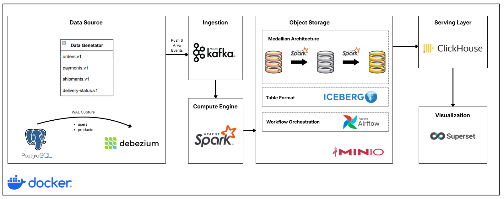

# end-to-end-e-commerce-lakehouse

A entry-level data lakehouse platform for e-commerce analytics, handling real-time order events and reference data with multi-layer transformation and aggregation.

## 📑 Table of Contents

- [Problem Statement](#-problem-statement)
- [Tech Stack](#-tech-stack)
- [Project Architecture](#-project-architecture)
- [Project Structure](#-project-structure)
- [Data Generation](#-data-generation)
- [Medallion Architecture](#-medallion-architecture-bronzesilvergold)
  * [Bronze Layer](#bronze-layer-real-time-raw)
  * [Silver Layer](#silver-layer-batch-cleansed)
    - [Partition Strategy](#partition-strategy)
    - [Clustering Strategy](#clustering-strategy)
  * [Gold Layer](#gold-layer-batch-aggregated)
- [Visualization](#-visualization)
- [Quick Start](#-quick-start)
- [Future Improvements](#-the-future-improvements)
- [References](#-references)
---

## 🎯 Problem Statement

E-commerce platforms generate massive volumes of transactional data across multiple stages: order placement, payment processing, shipping, and delivery. To drive business intelligence and operational insights, organizations need to:

1. **Ingest real-time events** at scale (120+ events/second).
2. **Maintain reference data integrity** from multiple sources (customers, products) using Change Data Capture (CDC)
3. **Transform raw events** into analytics-ready dimensional models following medallion architecture (Bronze → Silver → Gold)
4. **Apply time-aware transformations** such as Slowly Changing Dimensions (SCD2) for customer and product history tracking
5. **Aggregate metrics efficiently** for BI dashboards (revenue, customer metrics, product performance)
6. **Enable fast analytical queries** optimized for business decision-making

This project demonstrates an enterprise-grade solution using a modern data stack: streaming ingestion (Kafka + Avro), distributed processing (Spark Structured Streaming + Spark SQL), ACID table format (Iceberg), workflow orchestration (Airflow), columnar analytics (ClickHouse), and visualization (Superset).

---

## 🛠 Tech Stack

| Component | Technology | Purpose |
|-----------|-----------|---------|
| **Streaming** | Apache Kafka | Event broker & distributed log |
| **Schema Registry** | Confluent Schema Registry | Avro schema management |
| **Data Processing** | Apache Spark | Batch & streaming ETL |
| **Table Format** | Apache Iceberg | ACID transactions & time travel |
| **Storage** | MinIO | S3-compatible object storage |
| **Orchestration** | Apache Airflow | DAG-based workflow scheduling |
| **Reference Data** | PostgreSQL | Source system (users, products) |
| **CDC Connector** | Debezium CDC | Real-time data capture |
| **Analytics DB** | ClickHouse | OLAP columnar database |
| **Visualization** | Superset | Self-serve BI dashboards |
| **Container Orchestration** | Docker Compose | Local development environment |

---

## 🏗 Project Architecture



---

## 📁 Project Structure

```
e-commerce-lakehouse-project/
├── README.md                          # Project documentation
├── docker-compose.yml                 # Local infrastructure definition
│
├── infra/
│   ├── data-generator/               # Event generation service
│   │   ├── main.py                   # Entry point
│   │   ├── config.py                 # Configuration
│   │   ├── requirements.txt
│   │   ├── domain/
│   │   │   ├── enums.py              # OrderStatus, PaymentMethod, etc.
│   │   │   └── policies.py           # Business logic rules
│   │   ├── ports/
│   │   │   └── event_publisher.py    # Publisher interface
│   │   ├── adapters/
│   │   │   ├── kafka/                # Kafka producer + Avro encoder
│   │   │   └── postgres/             # PostgreSQL seed data
│   │   ├── services/
│   │   │   ├── orders.py             # Order event generation
│   │   │   ├── deliveries.py         # Delivery event generation
│   │   │   └── common.py             # Shared utilities
│   │   └── util/
│   │       └── rate_limit.py         # Rate limiting logic
│   │
│   ├── spark-services/               # Spark jobs for ETL
│   │   ├── config.py                 # Spark configuration
│   │   ├── requirements.txt
│   │   ├── jobs/
│   │   │   ├── bronze_ingestion.py   # Real-time ingestion to Bronze
│   │   │   └── builders/             # Schema builders
│   │   ├── schemas/
│   │   │   ├── bronze_schemas.py     # Bronze table definitions
│   │   │   ├── iceberg_config.py     # Iceberg settings
│   │   │   └── silver_schemas.py     # Silver table definitions
│   │   └── adapters/
│   │       ├── kafka.py              # Kafka consumer
│   │       ├── iceberg.py            # Iceberg writer
│   │       ├── minio.py              # MinIO setup
│   │       └── config.py
│   │
│   ├── airflow/                      # Workflow orchestration
│   │   ├── dags/
│   │   │   ├── silver_retail_star_schema_dag.py    # Silver transformation
│   │   │   ├── gold_layer_marts_dag.py             # Gold aggregation
│   │   │   └── _spark_common.py      # Shared Spark operators
│   │   ├── plugins/                  # Custom operators
│   │   ├── requirements.txt
│   │   ├── entrypoint.sh
│   │   └── Dockerfile
│   │
│   ├── debezium/                    # CDC setup
│   │   ├── config/
│   │   │   └── demo-postgres.json   # PostgreSQL CDC connector config
│   │   └── start-with-connectors.sh
│   │
│   ├── postgres/                    # PostgreSQL initialization
│   │   ├── init.sql                 # Schema creation
│   │   ├── airflow-init.sql         # Airflow database
│   │   └── superset-init.sql        # Superset database
│   │
│   ├── clickhouse/                  # ClickHouse setup
│   │   ├── init.sql                 # Table creation
│   │   └── users.d/
│   │       └── default-user.xml     # User configuration
│   │
│   └── superset/                    # BI configuration
│       └── superset_config.py
│
├── notebooks/                        # Exploratory analysis & testing
│   ├── minio_explorer_bronze.ipynb
│   ├── minio_explorer_silver.ipynb
│   └── minio_explorer_gold.ipynb
│
└── scripts/                          # Utility scripts
```

---

## 🍀 Data Generation 

The `data-generator` service simulates real-time e-commerce events (see [data-generator](infra/data-generator/README.md)) 

---

## 💎 Medallion Architecture (Bronze/Silver/Gold)

### Bronze Layer (Real-time, Raw)

Ingests streaming data every **10 seconds** using Spark Structured Streaming.

| Table | Source | Storage | Key Columns |
|-------|--------|---------|-------------|
| `bronze_orders` | orders.v1 | Raw Avro bytes | order_id, user_id, product_id, amount, ts |
| `bronze_payments` | payments.v1 | Raw Avro bytes | payment_id, order_id, status, ts |
| `bronze_shipments` | shipments.v1 | Raw Avro bytes | shipment_id, order_id, eta_days, ts |
| `bronze_delivery_status` | delivery-status.v1 | Raw Avro bytes | delivery_id, shipment_id, status, reason, ts |
| `bronze_users` | demo.public.users (CDC) | Raw Avro bytes | user_id, name, email, country, ts |
| `bronze_products` | demo.public.products (CDC) | Raw Avro bytes | product_id, name, title, category, price, ts |

**Characteristics:**
- Stores raw Avro bytes (NO decoding) for replayability
- Append-only, no updates or deletes regarding to tables such as `bronze_orders`, `bronze_payments`, `bronze_shipments`, `bronze_delivery_status` 
- Update-only for CDC tables (`bronze_users`, `bronze_products`) to capture changes
---

### Silver Layer (Batch, Cleansed)

Daily transformation at **01:00 UTC** produces enterprise-grade dimensional models.

**Dimension Tables:**

#### `dim_customers` (SCD2)
Time-aware dimension tracking customer address changes
```
user_id | name | email | country | valid_from | valid_to | is_current
```
- **SCD2 Type 2:** Historical tracking with effective dating
- **Updates:** New row when country or email changes.

#### `dim_products` (SCD2)
Product catalog tracking price and attribute changes over time
```
product_id | name | category | price | valid_from | valid_to | is_current
```
- **SCD2 Type 2:** Historical tracking with effective dating
- **Updates:** New row when price changes.

**Fact Tables:**

Three fact tables combine orders, payments, and shipments into analytical-ready format:

- **`fact_orders`** - Order transactions (order_id, user_id, product_id, amount, order_date)
- **`fact_payments`** - Payment records (payment_id, order_id, payment_method, status, amount, payment_date)
- **`fact_shipments`** - Shipment tracking (shipment_id, order_id, user_id, shipment_date, eta_days, actual_delivery, delivery_status)

---

#### Partition Strategy

All Silver tables use **date-based partitioning** to enable efficient query pruning:

- `dim_customers`, `dim_products` → partitioned by `scd_date`
- `fact_orders`, `fact_payments`, `fact_shipments` → partitioned by `order_date`

This enables scanning only relevant date ranges instead of entire table.

#### Clustering Strategy

Z-order clustering on frequently queried columns:

- `dim_customers` → `zorder(user_id, customer_sk, valid_from)`
- `dim_products` → `zorder(product_id, product_sk, valid_from)`
- `fact_orders` → `zorder(order_id, customer_sk, product_sk)`
- `fact_payments` → `zorder(payment_id, order_id)`
- `fact_shipments` → `zorder(shipment_id, order_id)`

* Note: `customer_sk` and `product_sk` are surrogate keys generated during transformation for efficient joins.
---

### Gold Layer (Batch, Aggregated)
Daily aggregation at **02:30 UTC** produces analytical marts optimized for BI queries.
**Analytical Marts:**
- `mart_sales_overview` - Daily revenue, revenue by category, top products
- `mart_customer_lifetime_value` - LTV by customer cohort

---

## 📊 Visualization

### Superset Dashboards

- This part will be developed in the future, but the idea is to create interactive dashboards in Superset that connect to ClickHouse and visualize key business metrics such as:
  - Daily revenue trends
  - Revenue breakdown by product category
  - Customer lifetime value distribution

---

## 🚀 Quick Start

### Prerequisites

- Docker & Docker Compose (v2.0+)
- 8GB+ RAM (16GB recommended), 20GB disk space

### Setup (1 minute)

```bash
# Clone and setup
git clone <project-url>
cd e-commerce-lakehouse-project

# Create .env file for ClickHouse
cat > .env << EOF
CLICKHOUSE_USER=default
CLICKHOUSE_PASSWORD=admin123
CLICKHOUSE_DB=ecommerce
EOF
```

### Core Services (Kafka, PostgreSQL, MinIO, etc.)

```bash
# Start core infrastructure
docker-compose up -d postgres zookeeper kafka schema-registry debezium kafka-ui minio clickhouse

# Wait for services (~30s)
docker-compose ps
```

### Data Generation

```bash
# Start mock data generator (120 events/sec)
docker-compose up -d data-generator

# Monitor events
docker-compose logs -f data-generator
```

### Optional: Spark Bronze Ingestion

```bash
# Start Spark cluster + Bronze ingestion
docker-compose --profile spark-ingest up -d

# Spark Master UI: http://localhost:8088
```

### Optional: Airflow Batch Transformation

```bash
# Start Airflow (scheduler, webserver, DAG processor)
docker-compose --profile airflow up -d

# Airflow UI: http://localhost:8085 (airflow/airflow)
```

### BI Visualization

```bash
# Start Superset
docker-compose up -d superset superset-init

# Wait for init (~60s)
sleep 60

# Superset UI: http://localhost:8089 (admin/admin)
```


* Note: This part isn't yet complete.

---

## 🚀 Full Deployment

```bash
# Start everything at once
docker-compose --profile spark-ingest --profile airflow up -d
```


### Access the Stack

| Service | URL | Username | Password | Purpose |
|---------|-----|----------|----------|---------|
| Airflow | http://localhost:8085 | airflow | airflow | DAG scheduling & monitoring |
| Superset | http://localhost:8089 | admin | admin | BI dashboards & analytics |
| Kafka UI | http://localhost:8080 | - | - | Kafka topic monitoring |
| ClickHouse | http://localhost:8123 | default | admin123 | OLAP analytics database |
| MinIO | http://localhost:9001 | minioadmin | minioadmin | S3-like object storage |
| PostgreSQL | localhost:5432 | admin | admin | Reference data & metadata |
| Schema Registry | http://localhost:8081 | - | - | Avro schema management |

## ⚡ The future improvements
-  Apply this to a real e-commerce platform instead of using a data simulation tool.
- Add more complex transformations in the Medallion architecture, such as data quality checks, enrichment with external data sources, or more advanced SCD handling.
- Implement a more robust monitoring and alerting system for the Airflow DAGs, such as integrating with Prometheus and Grafana for real-time metrics and alerts.


## References

- [data-forge Architecture](../../../data-forge/docs/architecture.md)
- [Confluent Avro Documentation](https://docs.confluent.io/kafka-clients/python/current/overview.html)
- [Schema Registry REST API](https://docs.confluent.io/platform/current/schema-registry/serdes-develop/index.html)

- [Spark Structured Streaming + Avro](https://spark.apache.org/docs/latest/structured-streaming-kafka-integration.html#avro-support)

- [Airflow DAG Best Practices](https://airflow.apache.org/docs/apache-airflow/stable/best-practices.html)